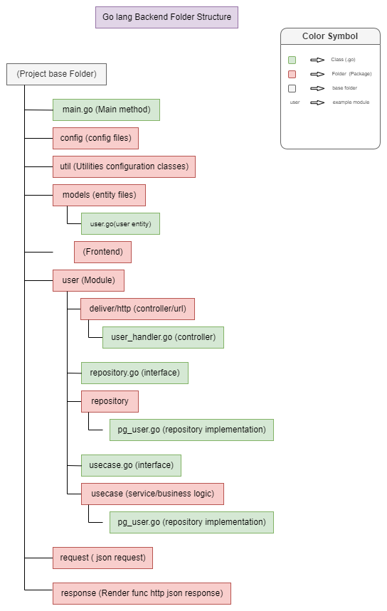

## [v1: CRUD 操作の基本システム (初級レベル)](https://github.com/IshmamAbir/CRUD-Go-Postgres-Vuetify3/tree/v1)

## [v2:パッケージシステムフォルダアーキテクチャ (クリーンアーキテクチャに準拠)](https://github.com/IshmamAbir/CRUD-Go-Postgres-Vuetify3/tree/v2)

<br>



<hr>
<br>

## スタートアップの手順

1.postgres に '`democrud`' データベースを作成する。

1.Visual Studio Code で、プロジェクトを開きます。

1.コマンドプロンプトを起動し、プロジェクトの以下のディレクトリに移動します。

```
cd C:\['your location']\CRUD-Go-Postgres-Vuetify3

```

2.バックエンドの起動

```
go run backend.go
```

1.コマンドプロンプトを起動し、プロジェクトの以下のディレクトリに移動します。

```
cd ./frontend
```

2.フロントエンドの起動

```
npm run serve
```

3.Edge/Safari などの Chromium 系ブラウザでアクセスする。  
 (npm run serve でビルドが完了すると、以下の URL が表示されます)。  
 で動作するアプリ。

[http://localhost:8080/](http//localhost:8080/)

## 使用した`の Library

1. Gorm ( gorm.io/gorm)
2. Gorilla Mux (github.com/gorilla/mux)
3. Postgres (gorm.io/driver/postgres)
